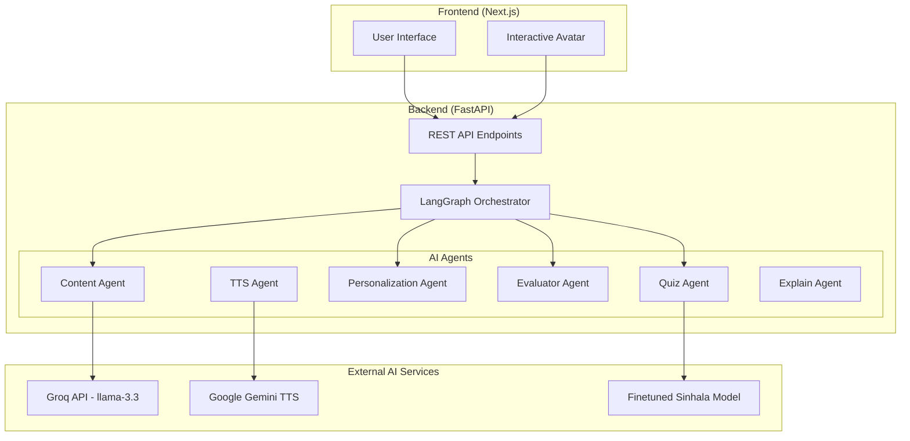

# 🎓 Sinhala-Teaching-AI-AVATAR

An intelligent, adaptive AI-powered e-learning platform designed to teach Sinhala. This project leverages a state-of-the-art **Hybrid PC-BKT (Predictive Cognitive Bayesian Knowledge Tracing) + BKT-LSTM** engine to dynamically track student mastery, adapt content difficulty in real-time, and provide an unparalleled personalized learning experience.

---

## ✨ Key Features

### 🧠 Advanced Personalization Engine
- **Hybrid PC-BKT + LSTM Fusion**: Combines traditional mathematical probability (BKT) with deep learning sequence prediction (LSTM) to calculate a highly accurate "Hybrid Mastery" score for every student on every skill.
- **Real-Time Adaptation**: As students answer questions online, the system instantly evaluates their mastery, triggering adaptive signals (`hint_required`, `adapt_difficulty`) to dynamically serve easier or harder questions mid-quiz.
- **Cross-Lesson Knowledge Transfer**: Students don't start from scratch on every lesson. The system calculates a `transfer_L0` baseline using their historical mastery in related topics within the same subject.
- **Behavioral Clustering**: Uses Exponential Moving Average (EMA) K-Means clustering to profile students into behavioral groups (Fast Learner, Struggling, Careless). These profiles dynamically adjust the Bayesian priors (Learn Rate, Guess Rate, Slip Rate) to match the student's unique learning style.
- **IRT-Style Problem Difficulty**: Continuously recalculates the difficulty of individual questions based on global student success rates.

### 🤖 Multi-Agent AI System
Powered by **LangGraph** and **Groq**, the backend utilizes specialized agents to orchestrate the learning journey:
- **Personalization Agent**: The core orchestrator that evaluates quizzes, manages the BKT-LSTM pipeline, and triggers remediation.
- **Content Agent**: Generates highly contextual lesson content dynamically.
- **Quiz Agent**: Creates tailored quizzes and evaluates student answers.
- **Explain Agent**: Provides simplified, context-aware explanations when a student is stuck.

### 🗣️ Interactive AI Avatar
- Integrated Text-to-Speech (TTS) engine to generate realistic teacher speech (`/generate-tts/`) for a fully immersive avatar-driven experience.
- RAG-powered Q&A endpoint (`/ask-question`) for students to ask questions and receive context-aware Sinhala answers.

---

## 🛠️ Technology Stack

**Frontend**
- React.js / Vite
- Tailwind CSS

**Backend**
- Python / FastAPI
- MongoDB (via Azure CosmosDB compatibility)
- TensorFlow / Keras (For LSTM model)
- LangChain / LangGraph (For multi-agent orchestration)
- ChromaDB (Local Vector Store for RAG)
- Groq Cloud API (For LLM Inference)

---

## 🚀 Getting Started

### Prerequisites
- Node.js (v18+)
- Python 3.10+
- MongoDB instance (Local or Atlas)
- Groq API Key

### Backend Setup
1. Navigate to the backend directory:
   ```bash
   cd backend
   ```
2. Create and activate a virtual environment (optional but recommended):
   ```bash
   python -m venv venv
   source venv/bin/activate  # On Windows use: venv\Scripts\activate
   ```
3. Install dependencies:
   ```bash
   pip install -r requirements.txt
   ```
4. Set up your `.env` file in the `backend/` directory:
   ```env
   GROQ_API_KEY=your_groq_api_key_here
   MONGO_URI=your_mongodb_connection_string
   SECRET_KEY=your_jwt_secret_key
   ```
5. **(Critical)** Generate the LSTM Weights and Skill Map. The personalization engine requires the pre-trained neural network:
   ```bash
   python -m training.train_lstm
   ```
6. Start the FastAPI server:
   ```bash
   uvicorn main:app --reload
   ```
   The backend will be available at `http://127.0.0.1:8000`.

### Frontend Setup
1. Navigate to the frontend directory:
   ```bash
   cd frontend
   ```
2. Install dependencies:
   ```bash
   npm install
   ```
3. Start the Vite development server:
   ```bash
   npm run dev
   ```
   The frontend will be available at `http://localhost:3000`.

---

## 🏗️ Architecture Overview

The system is designed as a modern, decoupled web application orchestrating multiple AI services and agents via **LangGraph**.

### 1. High-Level System Architecture



### 2. User Learning Flow

The core of the application is a stateful learning loop managed by the LangGraph Supervisor (`supervisor.py`).

1. **Pre-Quiz Initiation**: A user requests a pre-quiz for a new topic.
2. **Evaluation**: When answers are submitted, the `EvaluatorAgent` grades them.
3. **Personalization**: The `PersonalizationAgent` processes the results through the Hybrid PC-BKT + LSTM engine.
4. **Content Generation**: Based on the new mastery level (Beginner/Intermediate/Advanced), the `ContentAgent` dynamically generates an appropriate lesson.
5. **Post-Quiz**: After the lesson, a post-quiz is administered to check if mastery improved.
6. **Decision**: The `DecisionAgent` decides if the user moves to the `NEXT_TOPIC` or needs to `REPEAT_LESSON`.

### 3. The Hybrid Personalization Engine (PC-BKT + LSTM)

This engine calculates a robust metric of a student's true understanding:
1. **Base Mastery (BKT)**: Traditional Bayesian Knowledge Tracing updates the probability that a student knows a skill based on their correct/incorrect answers. It uses personalized priors (Learn Rate, Guess Rate, Slip Rate) determined by a **K-Means Clustering** of the student's historical behavior.
2. **Predictive Mastery (LSTM)**: A pre-trained neural network predicts the *future* mastery trajectory based on current BKT mastery, cluster, and question difficulty.
3. **Hybrid Fusion**: The system calculates a `hybrid_mastery` using weighted fusion: `(0.7 * BKT_Mastery) + (0.3 * LSTM_Prediction)`. 
4. **Feedback Correction**: If the LSTM predicts a mastery significantly lower than the BKT (divergence > 0.20), it suspects guessing and applies a negative feedback correction.

### 4. RAG (Retrieval-Augmented Generation) & Q&A Workflow

For ad-hoc student questions (`/ask-question/`), the system uses RAG:
1. **Vector Store**: Educational texts are embedded (`multilingual-e5-base`) and stored locally in **ChromaDB**.
2. **Retrieval**: Queries fetch the top 5 most relevant context chunks.
3. **Generation**: The context + question is sent to a custom **Fine-Tuned Sinhala Model** (hosted externally via Ngrok) to generate a contextually accurate, simple Sinhala answer.

Detailed technical breakdowns can be found in the `system_architecture_report.md` artifact.

---

## 📜 License
This project was developed as a Final Year Project (FYP). All rights reserved.