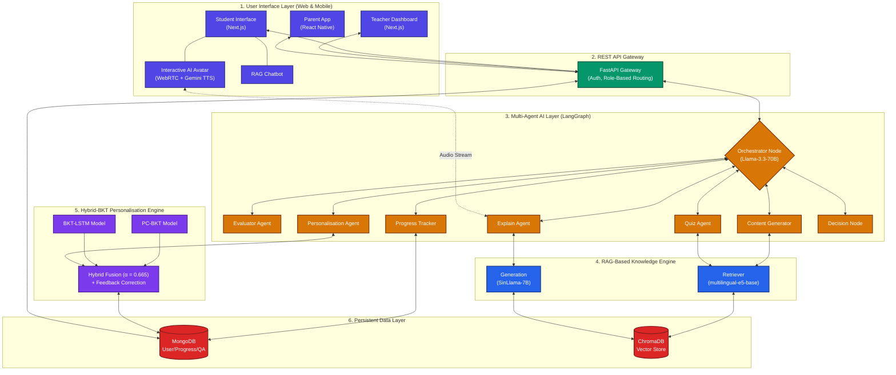

# 📊 System Architecture Diagram (V8 Edition)

This is the updated Mermaid diagram code reflecting the 6-layer architecture, 7 LangGraph agents, dual LLM approach, Hybrid-BKT engine, ChromaDB RAG, and interactive Avatar.

