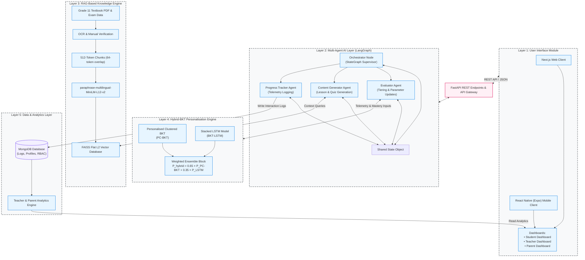
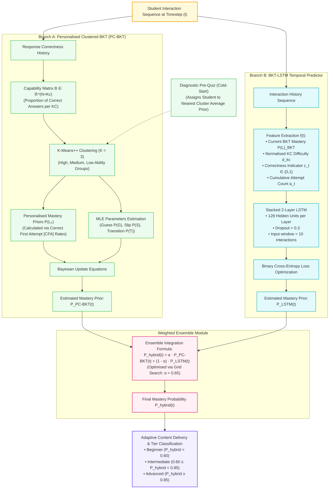
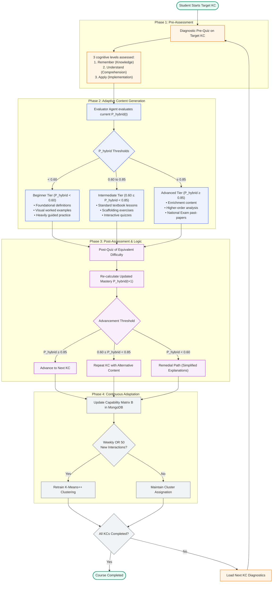
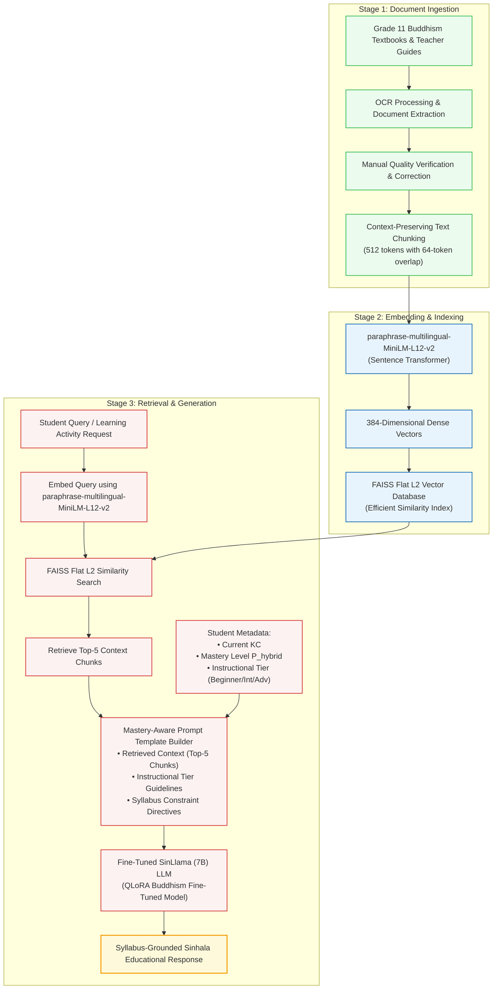
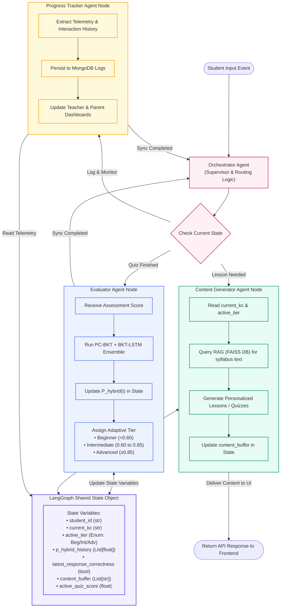

# Mermaid Diagrams for Conference Paper

This document contains the Mermaid source code for the five key diagrams required for the conference paper **"AI-Based Sinhala Assistant for Personalized A/L and O/L Learning"**.

These diagrams are designed to be imported directly into **draw.io** or generated using **Mermaid Live Editor** to download high-resolution PNG/SVG assets for the publication.

---

## How to Import into draw.io

To import these diagrams into draw.io:
1. Open [draw.io](https://app.diagrams.net/).
2. Select **File** -> **New** (or open your existing diagram).
3. In the top menu, go to **Extras** -> **Edit Diagram...**.
4. In the dialog box, clear any existing text, choose **Mermaid** from the drop-down menu at the bottom.
5. Copy one of the Mermaid code blocks below and paste it into the text area.
6. Click **Insert** or **Apply**. Draw.io will automatically parse the code and render it as editable shapes.
7. You can now adjust colors, fonts, and layouts as needed, then export as PNG (via **File** -> **Export as** -> **PNG...**).

---

## Fig. 1: System Architecture Diagram

This diagram visualizes the 5-layer modular architecture connected via FastAPI REST endpoints, showing the user roles, dashboards, agents, RAG pipeline, student models, and persistent storage.

---

## Fig. 2: Hybrid-BKT Personalisation Engine Architecture

This diagram details the parallel execution paths of the PC-BKT and BKT-LSTM branches and their weighted integration, ensuring both structural domain dependency and deep sequential context are captured.

---

## Fig. 3: Adaptive Assessment Cycle Flowchart

This flowchart maps the four-phase cyclic progression of student assessment, scaffolding classification, and advancement criteria, complete with pedagogical thresholds.

---

## Fig. 4: Retrieval-Augmented Generation (RAG) Pipeline

This diagram shows the 3-stage RAG data ingestion, embedding, FAISS indexing, context retrieval, prompt template construction, and SinLlama text generation process.

---

## Fig. 5: Multi-Agent Workflow (LangGraph State Transitions)

This state transition graph visualizes the LangGraph agent coordination engine, illustrating the shared state parameters, agent boundaries, and data synchronization patterns.

