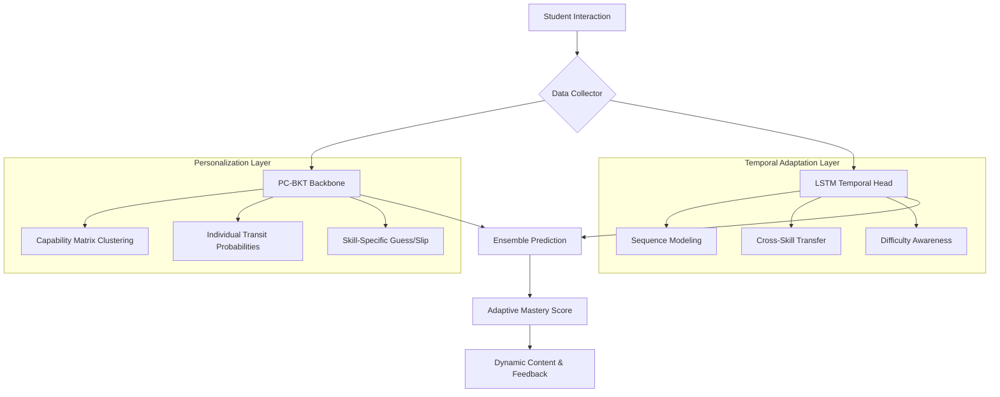
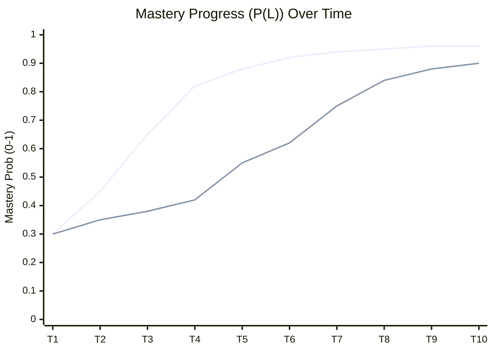

# Technical Report: Personalization and Adaptation in Sinhala-Teaching AI Avatar

## 1. Executive Summary
The Sinhala-Teaching AI Avatar project implements a state-of-the-art **Hybrid-BKT (Bayesian Knowledge Tracing)** system designed to provide a truly personalized learning experience for Grade 11 Buddhism students. By combining traditional probabilistic modeling (PC-BKT) with deep temporal learning (LSTM), the system adapts in real-time to each student's unique learning pace, existing knowledge gaps, and cognitive patterns.

## 2. System Architecture: The Hybrid-BKT Engine
The personalization engine is built on a "Backbone + Head" architecture that balances interpretability with predictive power.

### 2.1 Component Breakdown
- **PC-BKT (Personalized Clustered BKT)**: Handles the "cold-start" problem by clustering students into performance-based profiles. It provides the foundational mastery probability ($P(L)$).
- **LSTM (Long Short-Term Memory)**: Captures complex temporal dependencies, such as how long a student takes to master a concept and how success in one sub-topic influences another.
- **Ensemble Layer**: Combines both models using a weighted alpha ($\alpha = 0.65$ for PC-BKT, $0.35$ for LSTM) to ensure reliable, high-confidence predictions.

---

## 3. Personalization Mechanisms

### 3.1 Student Clustering & Capability Matrix
The system avoids a "one-size-fits-all" approach by analyzing the **Capability Matrix**—a historical performance record across all Knowledge Components (KCs).
- **Algorithm**: K-Means Clustering ($n=4$).
- **Impact**: New students are assigned to a cluster (e.g., "Advanced," "Steady Learner," "Struggling") based on their initial interactions, allowing the system to set realistic initial priors ($P(L_0)$).

### 3.2 Individual Learning Rates ($P(T)$)
Unlike standard BKT which uses a global transition probability, our system calculates a **Personalized $P(T)$** for every student:
$$ P(T)_s = \frac{\sum_{t=1}^n (1 - K_{t-1}) \cdot K_t}{\sum_{t=1}^n (1 - K_{t-1})} $$
This reflects the student's unique "learning speed," acknowledging that some students transition from "not-known" to "known" faster than others.

### 3.3 Feature Enrichment
The LSTM is fed with a rich 128-dimensional feature vector at each step, including:
- **Mastery Vector**: Current $P(L)$ across ALL skills.
- **Cluster ID**: One-hot encoded student profile.
- **Problem Difficulty**: 10-level scale derived from global success rates.
- **Attempt Ratio**: Progress indicator $(Current Step / Total Expected)$.

---

## 4. Adaptation Mechanisms

### 4.1 Mastery-Based Adaptive Thresholds
The system categorizes students into three recommendation levels based on the hybrid mastery score:

| Level | Threshold | Adaptive Strategy |
| :--- | :--- | :--- |
| **Advanced** | $> 0.85$ | Enrichment content, complex critical thinking questions (Blooms L4-L5). |
| **Standard** | $0.60 - 0.85$ | Reinforcement content, standard practice (Blooms L2-L3). |
| **Remedial** | $< 0.60$ | Foundational concepts, simplified explanations, and high-support feedback. |

### 4.2 Contextual RAG Feedback Loop
Adaptation extends beyond quiz scores to the **Feedback Layer**. The system uses RAG (Retrieval-Augmented Generation) to generate personalized explanations.

**Adaptation Logic in RAG:**
1. **Identify Gaps**: Detect specific "weak skill tags" (e.g., `apply_service_to_sick`) from the last quiz.
2. **Contextual Retrieval**: Search the knowledge base for content specifically addressing those tags.
3. **Tone Adaptation**: If student is in "Remedial," the prompt instructs the LLM to use "simple, encouraging language"; if "Advanced," it asks for "deep philosophy and challenge scenarios."

---

## 5. Performance Metrics & Analytics

### 5.1 Mastery Curve Prediction (Theoretical)
The graph below illustrates how the Hybrid-BKT model adapts to different student profiles over time.

*(Legend: Blue = Fast Learner (High P(T)), Red = Steady Learner (Clustered Prior))*

### 5.2 Model Parameters
- **Alpha ($\alpha$)**: 0.65 (Weight for PC-BKT backbone)
- **Sequence Length**: 10 (Temporal window for LSTM)
- **Dropout**: 0.3 (Preventing overfitting on small student histories)
- **$P(Know)$ Cap**: 0.95 (Preventing ceiling effect in Bayesian updates)

---

## 6. Implementation Highlights

- **Bilingual Support**: All adaptations are designed for Sinhala-speaking students with English technical terms.
- **Real-time Synchronization**: The backend updates the student state in MongoDB after **every single response**, ensuring the next question served is always the most appropriate one.
- **Privacy-First Clustering**: Clustering is performed on performance vectors, not personal data, ensuring anonymity while maintaining high personalization.

---
**Report Generated By**: Antigravity AI
**Project**: Sinhala-Teaching AI Avatar
**Date**: May 15, 2026
